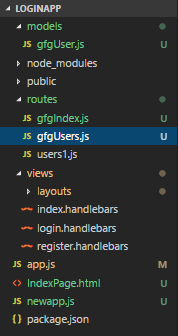

# MVC Architecture

## Model

The Model represents the data structure, format, and storage constraints of an application. It manages the application's data and essentially functions as the database component.

## View

The View presents data to users in their preferred format, utilizing the Model. Users may be permitted to modify the displayed data. Views comprise both static and dynamic pages that are rendered in response to user requests.

## Controller

The Controller manages user requests and generates appropriate responses for the View. The typical flow begins with user interaction in the View, which generates a request handled by the Controller. The Controller then responds by rendering the relevant view with model data.

### Summary

- Model: Data management
- View: User interface
- Controller: Request-response handling

project-name/
├── app.js (or server.js)
├── config/
│   └── database.js
├── controllers/
│   └── userController.js
│   └── productController.js
├── models/
│   └── userModel.js
│   └── productModel.js
├── routes/
│   └── userRoutes.js
│   └── productRoutes.js
├── views/
│   └── users/
│       └── index.ejs
│       └── show.ejs
│   └── products/
│       └── index.ejs
│       └── show.ejs
├── public/
│   └── css/
│   └── js/
│   └── images/

