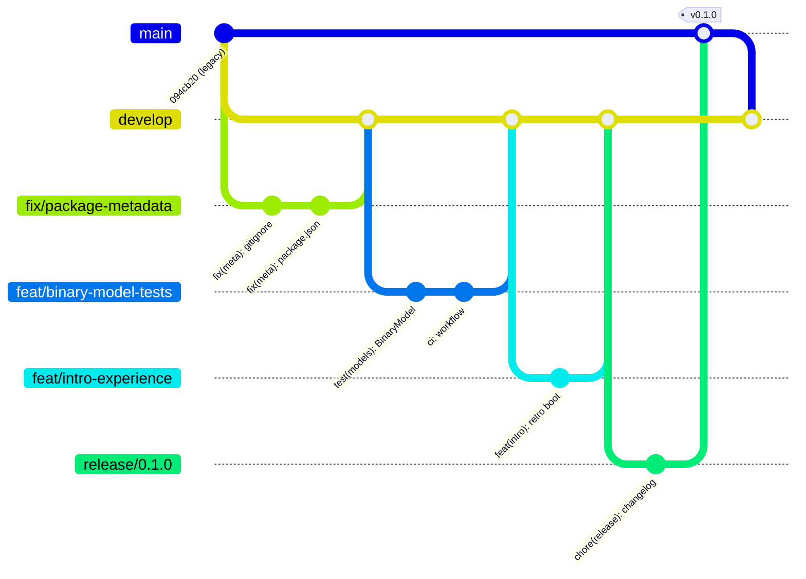

# Git workflow

This repository deliberately uses its own history as a teaching artifact.
The pre-`v0.1.0` history shows what a learning project looks like (snapshot
branches, ad-hoc messages); everything from `v0.1.0` onward demonstrates
the discipline described in [CONTRIBUTING.md](../CONTRIBUTING.md).

## The model

## Rules of the road

| Action | Rule |
|---|---|
| New work | Branch from `develop`, one feature per branch |
| Merging | `--no-ff` always — topology is documentation |
| Releasing | `release/<version>` branch → merge to `main` → annotated tag → back-merge to `develop` |
| History | Never rewrite anything that's been pushed |
| Old snapshots | Live under `archive/*`, read-only; cherry-pick with SHA citation |

## Why the old history is still here

Five weeks of an undetected stale counter taught this project's owner the
hard way: **a repo without verifiable history is unauditable by design.**
The early commits with messages like `updated readme` and `{commit_message}`
stay in the log as the "before" picture. The contrast with everything after
`v0.1.0` *is* the demonstration.
